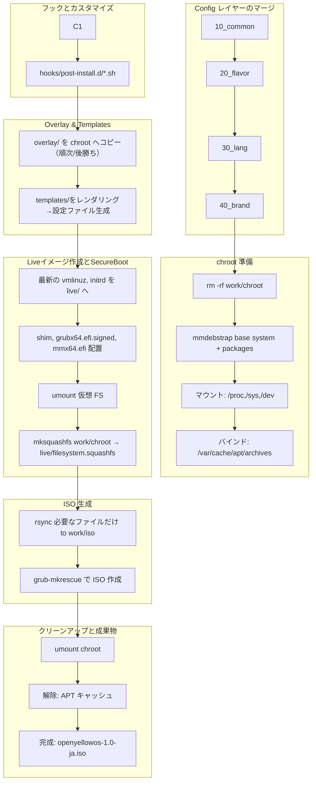

# oYo-Builder 仕組み

## oYo-Builder の仕組み：概要

1. **設定ファイルレイヤーの合成**
   - `config/10_common` → `config/20_flavor` → `config/30_lang` → `config/40_brand` の順で
   - `packages.txt`、`overlay/`、`hooks/`、`templates/` をそれぞれマージ

2. **chroot 準備**
   - 古い chroot を削除し、`mmdebstrap` で最小ベースシステム＋packages.txt記載パッケージを一括展開  
   - `/proc`・`/sys`・`/dev` をマウントし、ホストのAPTキャッシュもバインド

3. **フック（Hook）処理の実行**
   - `hooks/post-install.d/*.sh` → chroot展開・ユーザー作成・カスタム後に自動実行

4. **Overlay＆テンプレートの適用**
   - 各レイヤーの `overlay/` 配下ファイルを chroot 直下に順次コピー（後勝ち）
   - `templates/` 配下の Jinja2テンプレート（例: os-release, branding.desc, grub.cfg, plymouth など）をYAML変数付きでレンダリングし配置

5. **Live イメージ整形と Secure Boot対応**
   - 最新のカーネル/initrd を chroot/live/ にコピー
   - Secure Boot対応のshim, grubx64.efi.signed, mmx64.efiを ISO/EFI/BOOT 配下に配置
   - 仮想FSをアンマウントし、mksquashfsで live/filesystem.squashfs を生成

6. **ISO 生成**
   - 必要なディレクトリ（`boot/`, `EFI/`, `usr/lib/grub/`, `live/` など）だけを `rsync` で `work/iso/` に展開
   - `grub-mkrescue` で BIOS/UEFI 両対応のISOをビルド

7. **後片付け・成果物出力**
   - chroot・バインドのマウント解除
   - 完成したISOはプロジェクトルート直下に `openyellowos-1.0-ja.iso` のような命名で出力

---

## 全体フロー図

---

### 【主なテンプレート適用例】
- `os-release`  ... /etc/os-release にシステム情報を書き込み
- `branding.desc` ... Calamares インストーラ用ブランド定義
- `grub.cfg` ... BIOS/UEFIブート時のGRUB設定
- `plymouth-theme.conf` ... 起動画面アニメーション設定

---

### 【補足】
- 各 config レイヤーは**後勝ち（brand > lang > flavor > common）**で合成されます。
- Secure Boot対応はISO内部の`EFI/BOOT/`にshim/grubx64.efi.signed/mmx64.efiを配置することで実現します。
- 完成ISOはプロジェクトルート直下に作成され、`os-release`の内容に応じて命名されます。

---
