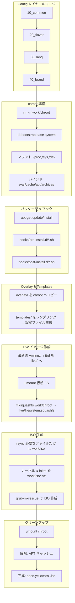

# oYo-Builder 仕組み

## oYo-Builder の仕組み：概要

1. **設定ファイルレイヤーをマージ**
   - `config/10_common` → `config/20_flavor` → `config/30_lang` → `config/40_brand` の順に  
   - `packages.txt` や `overlay/`、`hooks/`、`templates/` をそれぞれ読み込み

2. **chroot 準備**
   - 古い chroot を削除し、`debootstrap` で最小ベースシステムを展開  
   - `/proc`・`/sys`・`/dev` をマウントし、ホストの APT キャッシュもバインド

3. **パッケージのインストール**
   - マージした `packages.txt` に従い、`apt-get install`  
   - `hooks/pre-install.d/` → パッケージ前フック  
   - `hooks/post-install.d/` → パッケージ後フック  

4. **Overlay＆テンプレートの適用**
   - `overlay/` 配下のファイルを chroot 内に丸ごとコピー  
   - `templates/` 配下の Jinja2 テンプレートをレンダリングして設定ファイルを生成

5. **Live イメージ整形**
   - 最新のカーネルと initrd を `chroot/live/` にコピー  
   - 仮想ファイルシステムをアンマウントしてから `mksquashfs` で `/live/filesystem.squashfs` を作成

6. **ISO 生成**
   - 必要なディレクトリ（`boot/`, `EFI/`, `usr/lib/grub/`, `live/` など）だけを `rsync` で `work/iso/` に展開  
   - カーネル／initrd を `live/` にコピー  
   - `grub-mkrescue` で BIOS/UEFI 両対応の ISO をビルド

7. **後片付け**
   - chroot 内のマウント解除  
   - APT キャッシュバインド解除  
   - 完成した ISO は `open.yellow.os-<VERSION>.iso` として出力

---

## 全体フロー図

